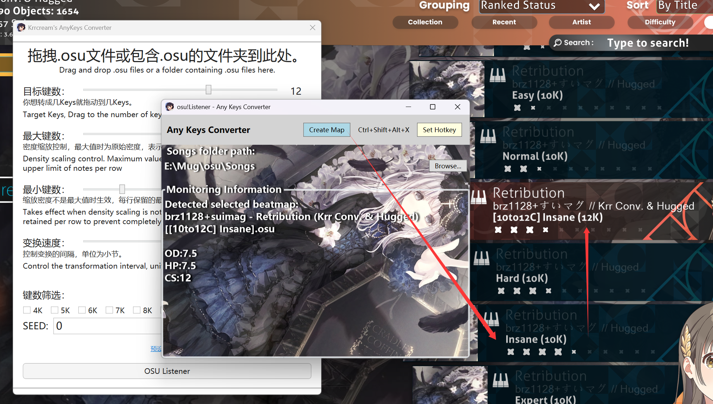

<h1>

🎵 krrcream's Toolkit

</h1>

<b>

A collection of tools for osu!mania beatmaps

</b>

These tools allow creating new maps by either dragging batch files into them or pressing hotkeys directly in-game.

English | <a href="./README_zh-hans.md">简体中文</a>

## 📥 Download

- [GitHub Release Page](https://github.com/krrcream/krrcream-Toolkit/releases) 🚀 *(Recommended)*
- [Baidu Netdisk](https://pan.baidu.com/s/1VBhS-RCG402KkjoX9obQNw?from=init&pwd=kr8k) 🔗 *(Password: kr8k)*

---

## 🛠️ Tools Included

### 🎵 krr AnyKeys Converter
Converts osu!mania beatmaps into any key layouts.

### 📝 YLS LN Transformer
Customize the proportion and length of long notes.

### 🗝 DP Tool
Keys doubling tool with adjustable density.

### 🗑️ .osu File Manager
Helps you organize and delete unwanted .osu files from your songs.

### 📊 krr LV Auto Rating
Automatically rates beatmaps based on KRR LV.

---

## 📸 Screenshots

### krr AnyKeys Converter / YLS LN Transformer / DP Tool

### .osu File Manager

### krr LV Auto Rating

---

## 📞 Contact
For any issues or inquiries, please contact me via:
- **Discord:** `krrcream`
- **QQ:** `510089504`
