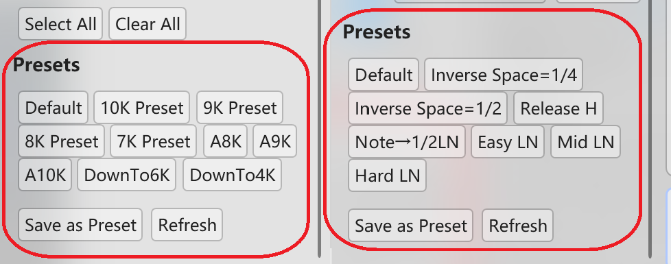
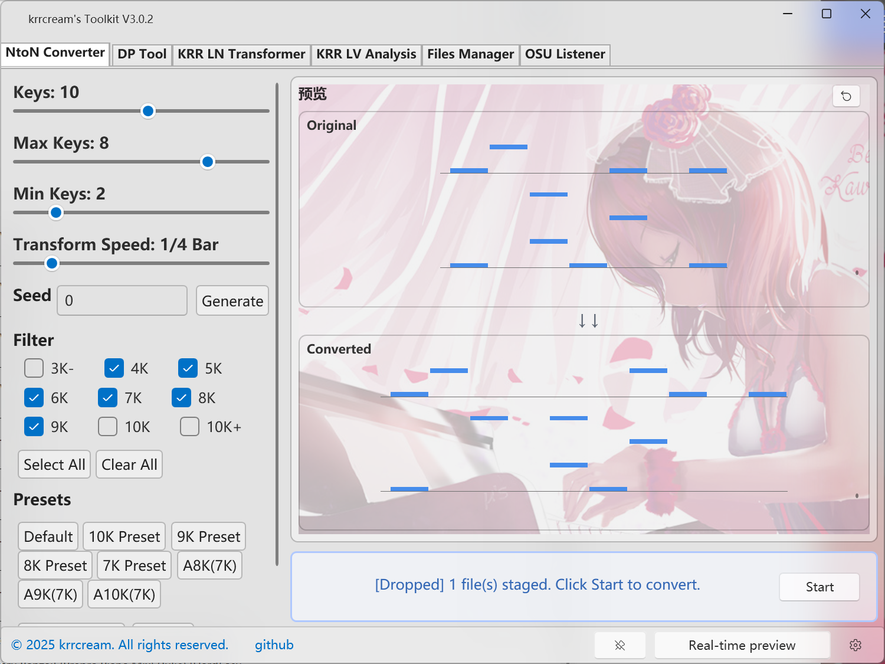
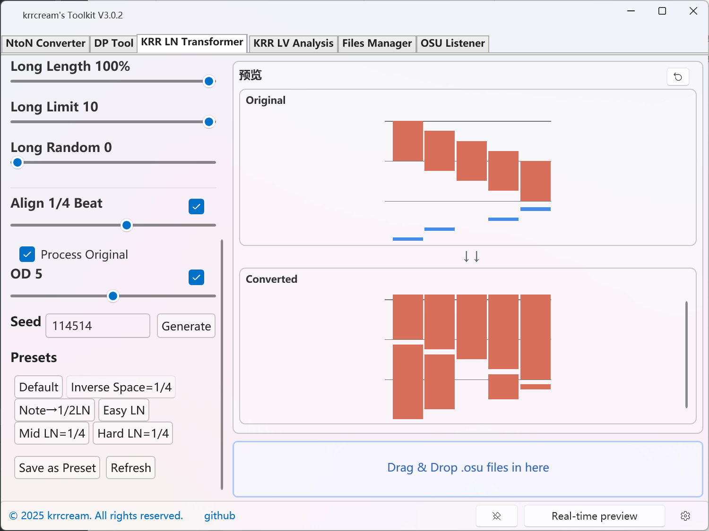
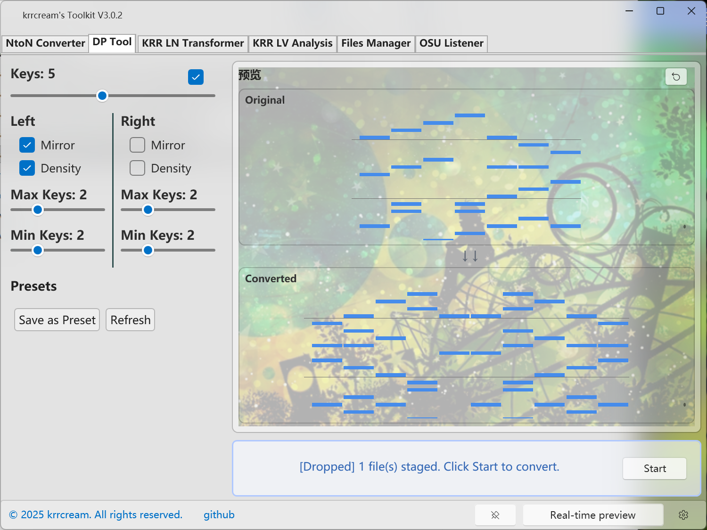
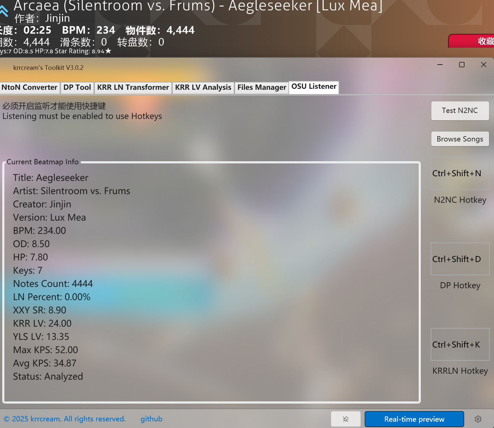
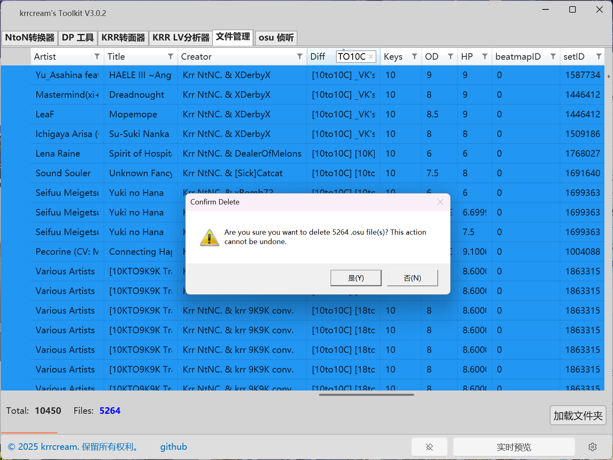
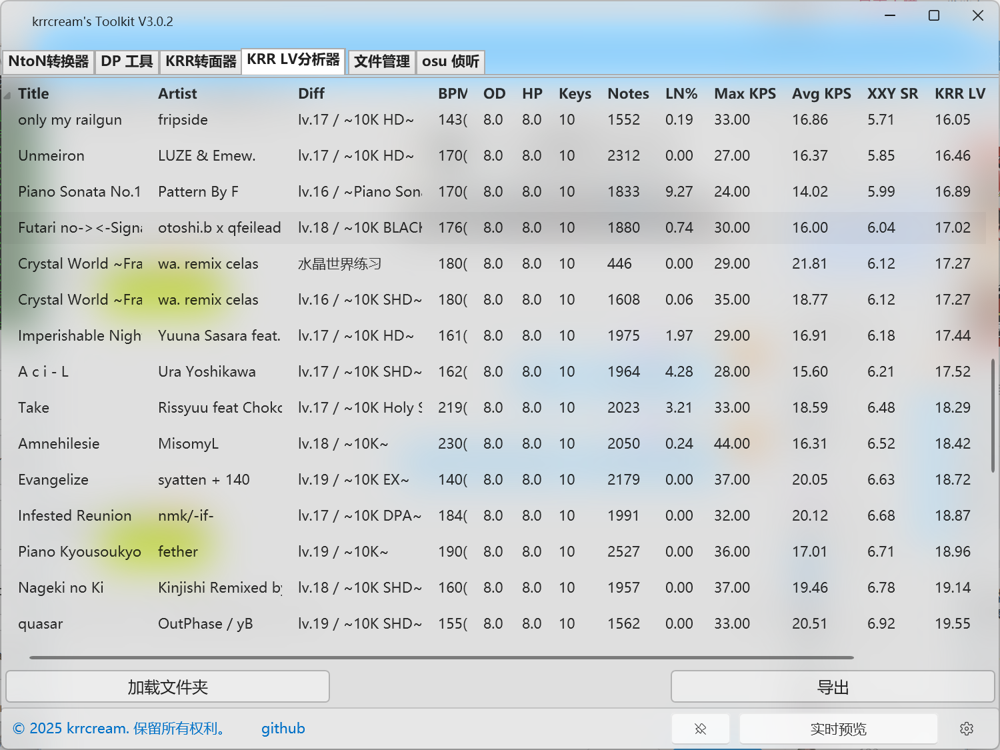

[English Version Readme](../readme.md)

# 🎵 krrcream's Toolkit

  <b>专为 osumania 转谱打造的工具集合</b>

特别感谢 [SK-la](https://github.com/SK-la) 对 UI 设计的贡献以及持续的维护支持。

## 如何使用

请参阅 [指南](doc/guide.md) 查看详细说明。

---

## 📥 下载

- [GitHub 发布页面](https://github.com/krrcream/krrcream-Toolkit/releases) 🚀 *(推荐)*
- [百度网盘](https://pan.baidu.com/s/1VBhS-RCG402KkjoX9obQNw?from=init&pwd=kr8k) 🔗 *(密码: kr8k)*

---

## 💡 主要功能

### 📁 批量处理
支持拖拽文件或文件夹进行批量谱面转换。

### ⌨️ 游戏内快捷键
支持在游戏内按快捷键完成转换。

### 🔄 一键转换
可使用默认设置快速转换，或从内置预设中选择，无需手动调整参数。

## 🛠️ 包含工具

### 🎵 krr AnyKeys Converter
支持任意键位模式 osu! 谱面转换。

### 📝 LN Transformer
自定义面条（Long Note）的比例与长度。

### 🗝 DP Tool
DP工具，支持密度调节。

### 🗑️ .osu 文件管理器
帮助你整理并删除歌曲目录中不需要的.osu文件。

### 📊 krr LV 自动评级
基于 XXY 星自动为谱面评级。

---

## 📸 截图

### 预设

### krr AnyKeys Converter / LN Transformer / DP Tool

### 快捷键

### .osu 文件管理器

### krr LV 自动评级

---

## 📞 联系方式

如有任何问题或建议，请通过以下方式联系我：
- **Discord:** krrcream
- **QQ:** 510089504
