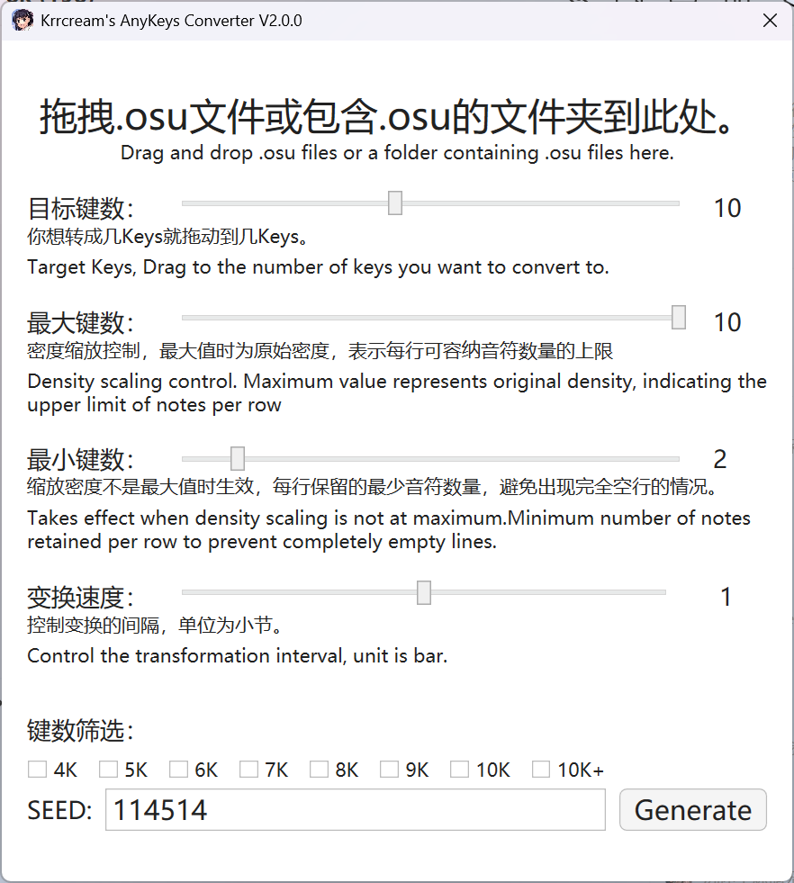
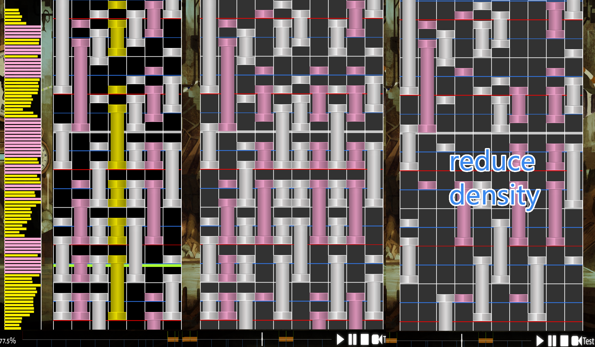
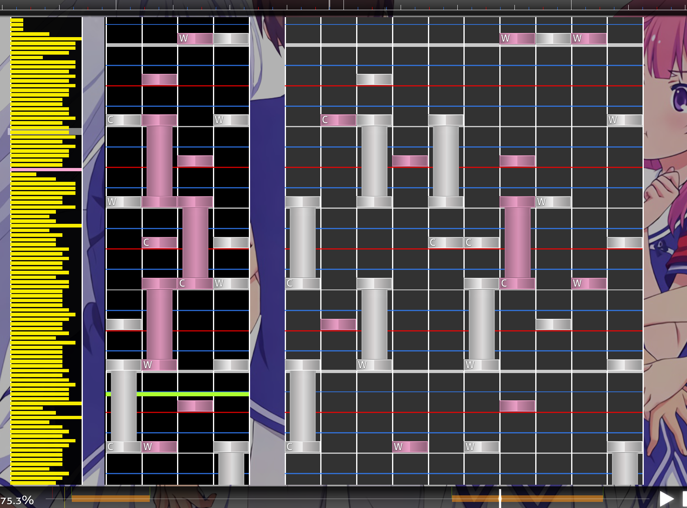


# 🎵 krrcream's Toolkit

  <b>A collection of tools for osumania beatmap</b>

## 📥 Download

- [GitHub Release Page](https://github.com/krrcream/krrcream-Toolkit/releases/tag/v1.0.0) 🚀 *(Recommended)*
- [Baidu Netdisk](https://pan.baidu.com/s/1VBhS-RCG402KkjoX9obQNw?from=init&pwd=kr8k) 🔗 *(Password: kr8k)*

---

## 🛠️ Tools Included

### 🎵 krr AnyKeys Converter
Converts osu! beatmap files with any keys layout.

**Update Notes:**
- Optimized the original NTONC algorithm to better preserve the original beatmap's pattern during the conversion process
- Implemented density reduction feature *(testing)*
- Currently only the algorithm for increasing keys is implemented

### 🗑️ .osu File Manager
Helps you organize and delete unwanted .osu files from your songs.

### 📊 krr LV Auto Rating
Automatically rates beatmaps based on KRR LV.

---

## 📸 Screenshots

### krr AnyKeys Converter

### .osu File Manager

### krr LV Auto Rating

---

## 📞 Contact
For any issues or inquiries, please contact me via:
- **Discord:** krrcream
- **QQ:** 510089504